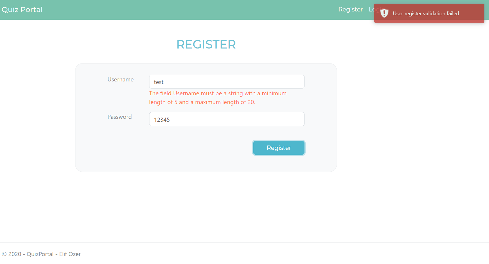
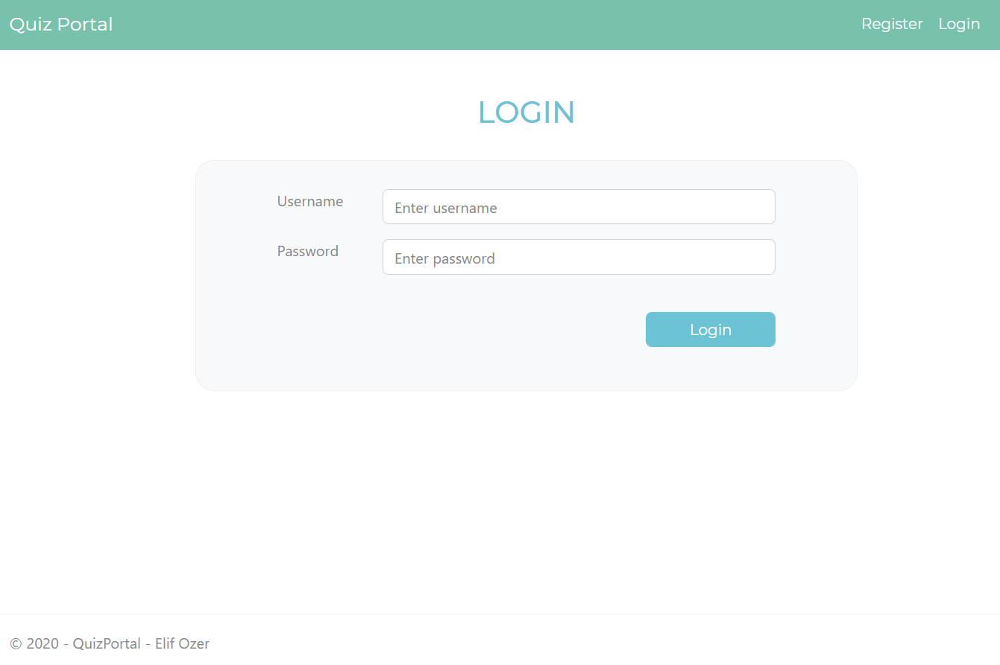
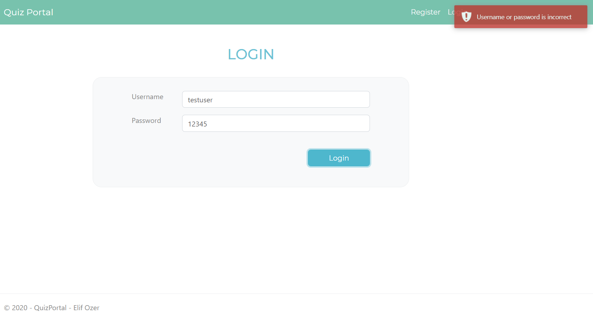
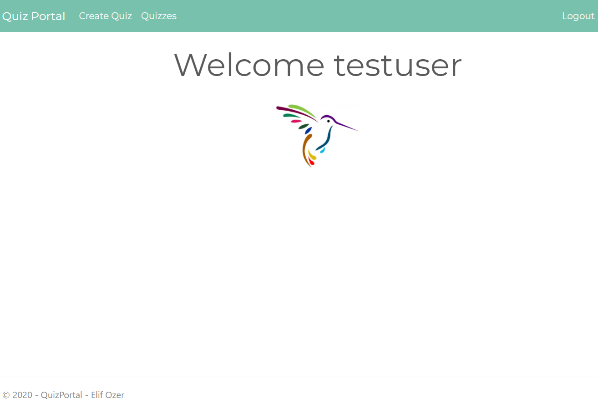
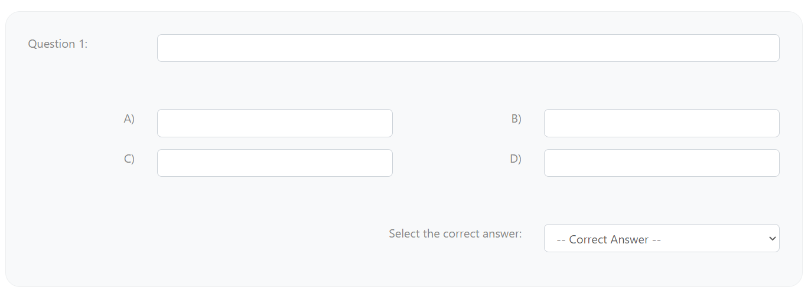
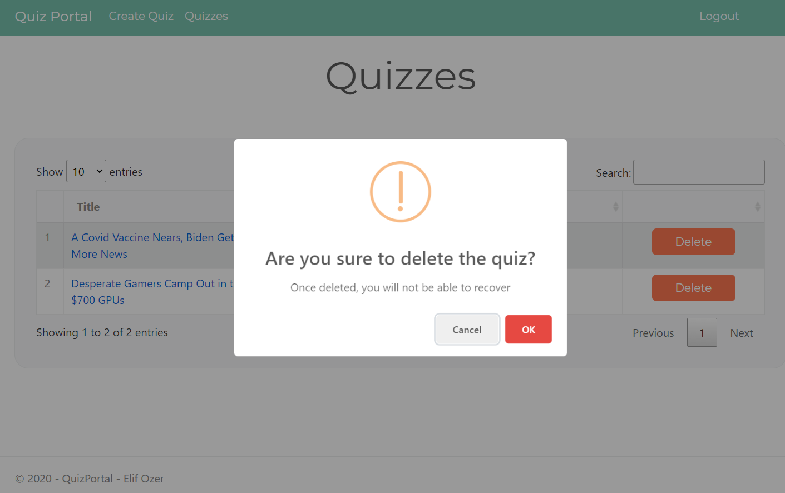
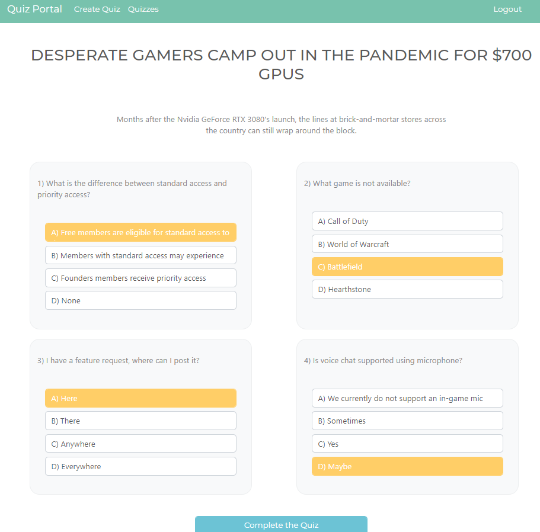
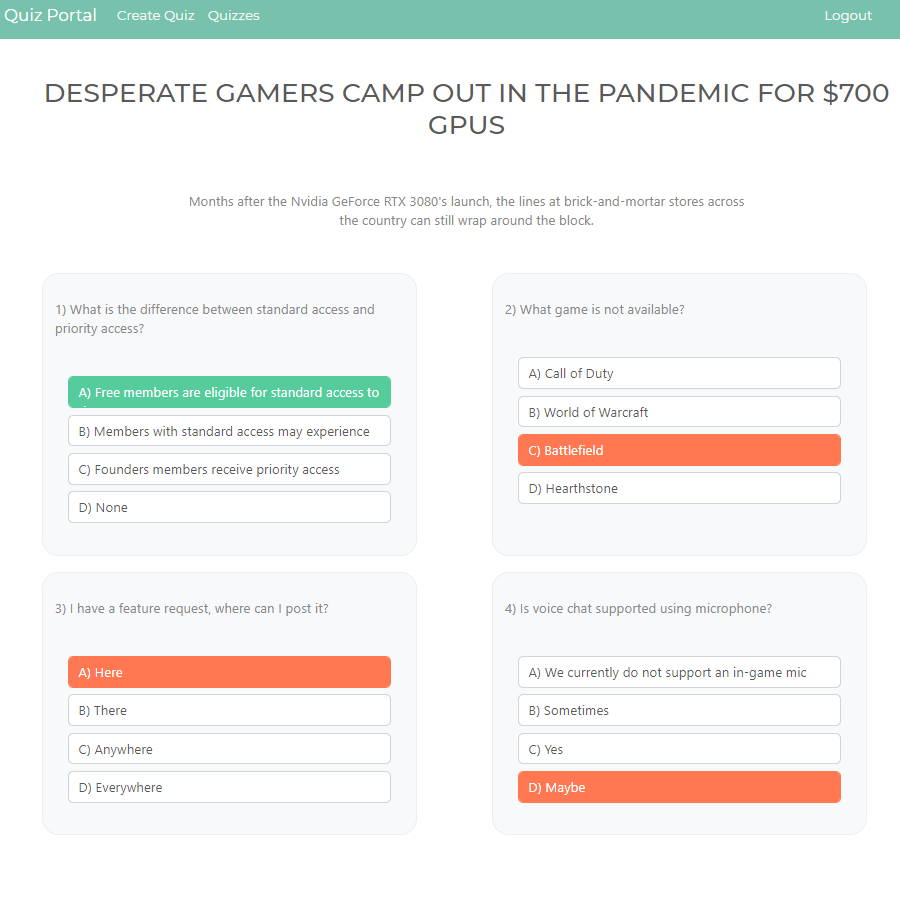

# Quiz Portal with ASP.NET Core MVC
In this project, I created a quiz portal where users can login with their credentials
and create quizzes about top five articles that are published on Wired.com. This article feed
is retrieved using Wired RSS feed. Users can create their own quizzes about these articles by
providing four questions. They can take quizzes as well as deleting them. Upon taking a quiz,
user is notified with their chosen answers being correct or incorrect.

## Development Environment

ASP.NET Core 3.1 SDK and SQLite as database are used during project development.
In order to communicate with the database, necessary Entity Framework Core packages are used.
During development, code first database migration approach is embraced.

As a result, ASP.NET Core 3.1 SDK is required to run this project.

## Screenshots

### Register

<i>Image 1: Register View</i>

 

This is the register view of the project where users can register to the website
by providing username and password. Necessary validations (both business and model) are applied and user is notified.
Upon successful register operation, user is redirected to the Login view.

### Login

<i>Image 2: Login View</i>

 

<i>Image 3: Login View (Fail)</i>

 

This is the login view of the project where users can login to the website using their credentials.
Necessary validations (both business and model) are applied and user is notified.
Upon successful login operation, user is redirected to the Home view and
Session begins to hold user's Id.

### Home

<i>Image 4: Home View</i>

 

This is the view that greets the user once he/she logs in. User can navigate to the page where quizzes can be
created or to the page where existing quizzes are shown using the navigation bar above.
Logout button can be seen on the upper right side of the navigation bar.

### Create Quiz

<i>Image 5: Create Quiz - Article Selection</i>

 

This is the view where user can create a quiz about one of the top five articles that are shown on Wired.com website.
These articles' titles are listed in the dropdown menu; therefore, user can select a specific article using this dropdown menu.
Once article is selected, article content is shown below the dropdown.

<i>Image 6: Create Quiz - Single Question</i>

User can create four questions about the chosen article. User should fill the question text,
fill the answer texts and choose a correct answer for each question. Question model is validated both on server side
and client side. User is provided with the necessary alerts. User clicks the button below to create the quiz after all of the inputs are provided.
Upon a successful quiz creation, user is redirected to the quiz list page where added quiz can be seen.

### Quiz List

Existing quizzes are listed using _DataTables_ on this view. User can click on delete button of a specific quiz. As a result, _SweetAlert_ is triggered.
Using SweetAlert pop-up, user can delete a quiz or opt-out if desired. If a quiz is deleted, page is dynmalically refreshed.

<i>Image 7: Delete Quiz</i>

If user clicks on a certain title on this table, he/she is redirected to that specific quiz's page. On this new page, user
can take the quiz by selecting answers. Upon submitting the answers, user can see if their submissions are correct or not.
This result is shown to the user without post-back.

<i>Image 8: Quiz Answer Selection</i>

<i>Image 9: Quiz Result</i>